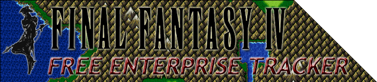

# FF4 Free Enterprise Tracker

A comprehensive tracker for Final Fantasy IV Free Enterprise randomizer with full manual and auto-tracking support.

## Features

### Core Functionality
- **Manual Tracking**: Click-to-track interface for all tracker elements
- **Auto-Tracking**: Real-time memory reading via [SNI](https://github.com/alttpo/sni) (recommended) or QUsb2Snes
- **Dual Layout Modes**: Switch between horizontal and vertical layouts
- **Comprehensive Flag Support**: Full support for FF4FE flags including Knofree variants, Cnoearned, and more

### Tracking Sections
- **Key Items** (18 items): Track all progression items
- **Bosses** (35 bosses): Monitor boss defeats
- **Objectives** (100+ objectives): Quest, boss, and character objectives
- **Locations**: Key item locations, character locations, and town checks
- **Current Party**: Live party display with character forms (Cecil DK/Paladin, Rydia Kid/Adult)

### Galeswift Fork Support
- Boss Collector objectives
- Gold Hunter objectives
- Objective Groups (Alpha groups A-E) with progressive rewards
- Dark Matter hunt, Key Item hunt and External objectives
- Seed Notes for Ctreasure, Kstart, gated/hard-required objectives and shop flags
- Tested against Galeswift v4.7.0

### Free Enterprise Alpha 5.0 Support
- Seeds from [alpha.ff4fe.com](https://alpha.ff4fe.com) (`v5.0.0-a.x`) are detected automatically from the ROM
- Objective groups with their rewards, auto-tracked
- Key item checks, character recruits and objectives auto-tracked (tested on SD2SNES hardware)
- Exact XP multiplier, read live from the game after each battle

## Quick Start

### Manual Tracking
1. Download the [latest release](https://github.com/durend/Durendx-FF4FE-Tracker/releases)
2. Extract the files
3. Open `launcher.html` in your web browser
4. Enter your flag string
5. Click "Launch Tracker"
6. Click items/bosses/locations as you find them

### Auto-Tracking Setup

The tracker reads the game's memory through a bridge program. **SNI is recommended**
(it's what v1.04 was tested with, on both BizHawk and SD2SNES hardware). QUsb2Snes
still works too - the tracker speaks the same protocol to both.

#### Required Software
- [SNI](https://github.com/alttpo/sni) (recommended) - download from [SNI Releases](https://github.com/alttpo/sni/releases)
- *or* [QUsb2Snes](https://github.com/Skarsnik/QUsb2snes/releases)

Run only one of them at a time - they fight over the same port and device.

#### Supported Emulators
- **BizHawk** (with the [Emulator Network Access tool](https://github.com/Skarsnik/Bizhawk-nwa-tool/releases), or SNI's Lua bridge)
- **RetroArch** (with network commands enabled, bsnes-mercury core recommended)
- **Snes9x-rr** (with Lua support)
- **snes9x-emunwa** (built-in support)

#### Supported Hardware
- **SD2SNES / FXPak Pro** connected by USB

#### Setup Instructions

##### Windows (SNI - recommended)

1. **Get SNI**
   - Download the Windows zip from [SNI Releases](https://github.com/alttpo/sni/releases)
   - Extract it into the tracker's `SNI` folder, so `sni.exe` sits next to `start_sni.bat`

2. **Start SNI with the included batch file**
   - Double-click `SNI\start_sni.bat`
   - SNI starts as an icon in the system tray (bottom-right, near the clock - check the `^` overflow arrow)
   - Why the batch file: SNI normally listens on port `23074`, but the tracker defaults to `8080`
     (the QUsb2Snes port). The batch file tells SNI to listen on **both**, so the launcher works
     without changing anything
   - If `sni.exe` isn't found, the batch file tells you where to put it
   - Prefer not to use the batch file? Run `sni.exe` directly and set the launcher's port to `23074`

3. **Connect Your Game**
   - **SD2SNES / FXPak Pro**: plug it in by USB and power on - SNI finds it on its own
   - **BizHawk**: install the [Emulator Network Access tool](https://github.com/Skarsnik/Bizhawk-nwa-tool/releases)
     into BizHawk's `ExternalTools` folder, then open it via `Tools -> External Tools`
   - **RetroArch**: enable network commands in settings
   - **snes9x-emunwa**: no configuration needed

4. **Start the Tracker**
   - Open `launcher.html`
   - Enter your flag string
   - Check "Enable Auto-Tracking"
   - Leave port at `8080` (or `23074` if you started `sni.exe` without the batch file)
   - Click "Launch Tracker"

5. **Load Your ROM**
   - Start your FF4 Free Enterprise ROM
   - The tracker connects, reads the seed from the ROM and starts syncing

##### Windows (QUsb2Snes)

1. Download and run [QUsb2Snes](https://github.com/Skarsnik/QUsb2snes/releases) - it starts a WebSocket server on port 8080
2. Connect your emulator or hardware as in step 3 above
3. Launch the tracker with port `8080`

##### Linux

> SNI also has Linux builds on its [releases page](https://github.com/alttpo/sni/releases). Run `sni` and set the launcher's port to `23074` (its default), or start it with `SNI_USB2SNES_LISTEN_ADDRS=0.0.0.0:23074,0.0.0.0:8080` to keep port `8080`. The QUsb2Snes steps below still work as well.

1. **Install QUsb2Snes**
   - **Arch Linux**: Install from AUR: `yay -S qusb2snes` or `paru -S qusb2snes`
   - **Other Distros**: Download from [GitHub Releases](https://github.com/Skarsnik/QUsb2snes/releases) or build from source
   - Run QUsb2Snes - it will start a WebSocket server on port 8080

2. **Choose Your Emulator**

   **Option A: BizHawk (Native Linux Build)**
   - **Arch Linux**: Install from AUR: `yay -S bizhawk-bin` or `paru -S bizhawk-bin`
   - **Other Distros**: Download `bizhawk-monort` from [BizHawk Releases](https://github.com/TASEmulators/BizHawk/releases)
   - Requirements: Mono (complete), OpenAL, Lua 5.4, glibc, lsb_release
   - Run with: `./EmuHawkMono.sh`
   - Install [Emulator Network Access plugin](https://github.com/Skarsnik/Bizhawk-nwa-tool/releases) to `ExternalTools` folder
   - Enable plugin via `Tools→External Tools` menu in BizHawk
   - **Note**: Network functionality for QUsb2Snes has not been extensively tested on Linux builds

   **Option B: RetroArch (Recommended)**
   - Edit RetroArch config: `~/.config/retroarch/retroarch.cfg`
   - Set: `network_cmd_enable = "true"`
   - Save and restart RetroArch
   - In QUsb2Snes, activate the RetroArch device from the devices menu
   - **Use bsnes-mercury core (recommended)** or Snes9x core
   - bsnes-mercury provides better ROM data access for auto-tracking

3. **Start the Tracker**
   - Open `launcher.html` in Firefox, Chrome, or any browser
   - Enter your flag string
   - Check "Enable Auto-Tracking"
   - Set port to `8080` (default)
   - Click "Launch Tracker"

4. **Load Your ROM**
   - Start your FF4 Free Enterprise ROM in your chosen emulator
   - The tracker will automatically connect and sync

**Linux Notes:**
- **BizHawk Linux builds are available** but are considered experimental. Network functionality may vary. RetroArch is still recommended for most users due to proven QUsb2Snes compatibility.
- Config files stored in: `$HOME/.config/skarsnik.nyo.fr/QUsb2Snes.conf`
- Logs stored in: `$HOME/.local/share/QUsb2Snes`
- If you have serial device issues, you may need to adjust TTY settings (see QUsb2Snes documentation)

## Technical Details

- **Protocol**: WebSocket communication via the usb2snes protocol (SNI or QUsb2Snes)
- **Polling Rate**: 100ms memory read interval
- **Memory Addresses**: Reads SNES WRAM at `0x7E0000-0x7FFFFF`
- **Protection Logic**: Smart filtering prevents data loss during save browsing
- **Party Persistence**: Maintains party slot assignments across saves

## Layout Modes

### Horizontal Mode (Default)
- Key Items and Current Party on the left
- Boss Tracker in the middle
- Locations, Characters, and Towns on the right
- Objectives below

### Vertical Mode
- Compact single-column layout
- Key Items and Objectives stacked
- Boss Tracker below
- Locations and Characters at bottom

Toggle between modes using the launcher or URL parameter `v=1`.

## Tracker Sections Explained

### Key Items
Track the 18 key progression items (Package, SandRuby, Baron Key, etc.)

### Bosses
35 boss encounters from Mist Dragon to the optional superbosses

### Objectives
100+ objectives based on your flag settings:
- Quest objectives (complete dungeons, defeat specific bosses)
- Character objectives (recruit specific characters)
- Boss objectives (defeat boss groups)
- Special objectives (Boss Collector, Gold Hunter, Objective Groups)

### Locations
- **Key Item Locations**: 29 key item check locations
- **Character Locations**: Where characters can be recruited
- **Town Locations**: Town-specific checks

### Current Party
Displays your active party with character portraits. Shows character forms:
- Cecil: Dark Knight / Paladin
- Rydia: Kid / Adult

## Flag Support

Comprehensive support for FF4FE flags including:
- **K Flags**: Kmain, Ksummon, Kmoon, Ktrap, Knofree (and variants)
- **C Flags**: Cstandard, Crelaxed, Cnoearned, Cnofree
- **O Flags**: All objective types and requirements
- **Special Modes**: Mystery seeds, Boss Collector, Gold Hunter
- **Alpha Groups**: Objective groups A-E with progressive rewards

## Bug Fixes (v1.0.0)

- Fixed Toroia Castle location visibility with Knofree flags
- Fixed vertical mode disable handlers for boss tracker and location tracking
- Fixed character cleanup when switching save files
- Fixed manual tracking stability (locations no longer flicker)
- Fixed ApplyChecks initialization on page load

## Changes (v1.01)

- Fixed Cnoearned/Cnofree character location visibility bug - character locations now properly stay hidden when tracker is reloaded during auto-tracking

## Changes (v1.02)

- Added boss name tooltips - hover over any boss icon to see its full name

## Changes (v1.04)

**Free Enterprise Alpha 5.0 support** (seeds from alpha.ff4fe.com, `v5.0.0-a.x`).
The tracker reads the ROM's version and switches automatically - 4.6.X and
Galeswift 4.7.0 seeds work exactly as before.

- Alpha 5.0 objective groups, including group-to-group requirements and
  rewards, shown grouped in the Objectives panel
- Auto-tracking of Alpha 5.0 objectives (including counted ones like Dark
  Matter and key item hunts), key item checks and character recruits -
  tested live on SD2SNES hardware and BizHawk
- Includes the two checks Alpha 5.0 records differently (Feymarch Chest and
  the Lunar Ribbon altar)

**Exact XP multiplier on Alpha 5.0**
- The XP display now shows the game's own multiplier, read after each battle
  (the "Received N Exp. (M x)" value), instead of estimating it from flags.
  It's remembered for the seed when you refresh
- Before your first battle, and always on Galeswift (which doesn't store the
  multiplier), the flag-based estimate is shown. Hover the XP display to see
  which one you're looking at
- The display now truncates like the game does (2.808 shows as 2.8x, not 2.81x)
- Flag estimate: added Alpha 5.0's `Xobjbonus:N` name and the `Xmaxmulti:N` cap

**SNI support**
- SNI is now the recommended bridge (QUsb2Snes still works). The release
  includes `SNI\start_sni.bat`, which starts SNI on the tracker's default port
  - see Auto-Tracking Setup above

**Known limitations**
- Alpha 5.0 is itself still in alpha; a future alpha could change how it
  stores things in memory
- `Xbonuses:mul` (multiplicative bonus mode) isn't used by the flag estimate
- On Galeswift seeds the XP display is still an estimate, and it can read low
  when `Xkicheckbonus` / `Xzonkbonus` are on (the game counts these
  differently than the tracker does). This has been the case since v1.03 and
  is planned for a follow-up fix

## Changes (v1.03.2)

Hotfix for four pre-existing tracking bugs, found and verified while building separate Alpha 5.0 support (identical code, not specific to any flag version).

- Fixed `Xzonkbonus:N` (a real Galeswift X flag) being parsed but never actually applied to the XP modifier - it was dead code
- Fixed `-Pushbtojump` (an April Fools joke mode that explicitly doesn't affect item placement) being mistakenly treated as a universal bypass on ~12 key-item/character/town prerequisite checks - Tower of Zot, Baron Castle, Magnes Cave and others could show as available with none of their prerequisite key items
- Fixed `Ksummon`/`Kmoon`-gated locations (Baron Odin, Fey Asura/Leviathan, Sylph Cave, Bahamut, all 5 Lunar locations) getting permanently stuck hidden on any seed that doesn't set those flags (most seeds), even after their real prerequisite (Darkness Crystal) was obtained
- Fixed `Cnogiant` ("no character at Giant of Bab-il") being parsed but never applied - that character location kept showing as available regardless of the flag

## Changes (v1.03.1)

Hotfix for auto-tracking on real hardware (FXPak Pro / SD2SNES).

- Fixed bosses sometimes not being auto-tracked on hardware (e.g. both Dwarf
  Castle bosses)
- Fixed the main cause of items, checks, objectives and the party
  flickering on hardware: replies from QUsb2Snes arrive more slowly and in
  pieces on hardware, and the tracker could mix up replies between its
  requests. Requests are now sent one at a time and each reply is read in
  full
- Fixed the seed not always being recognized on hardware, which could stop
  your saved progress from coming back

## Changes (v1.03)

Updated and tested for **Galeswift v4.7.0** (all 61 official presets plus
fork-specific flag combinations load cleanly).

**New Galeswift flag support**
- `Omode:dkmatterN` (Dark Matter hunt counter), `Omode:kiN` (Key Item hunt,
  counted automatically from the Key Items panel), `Omode:external`
- New **Seed Notes** panel for `Ctreasure`, `Kstart`, `Ogated`, `Ohardreq`
  and shop flags (`Sprice`, `Spricey`, `Smixed`, `Ssame`, `Ssingles`)
- Multiple random objective pools (`Orandom2:`, `Orandom3:`) and `tough_quest`

**New features**
- **XP modifier** on the left of the Key Items header (e.g. `XP:1.5x`), based
  on key items gained and the seed's X flags: x2 at 10 key items (unless
  `Xnokeybonus`), `Xcrystalbonus`, `Xkicheckbonus:N` and `Xobjectivebonus:N`.
  Hover it to see which bonuses apply
- **Auto boss tracking**: with auto-tracking on, each boss is marked defeated
  in the Boss Tracker as soon as you win the fight (works with boss rando and
  `Balt:gauntlet`). New **Auto-Track Bosses** toggle in the launcher (on by
  default). Bosses beaten before connecting still need a click
- **Pass auto-tracks** (read from your inventory, since the game keeps no
  "found" flag for it), however you get it: `Pkey`, shop, chest or `Kstart:pass`
- New **Dwarf Castle [Cid]** location for the `Knofree:dwarf` free key item
  (the existing one is now labelled **Dwarf Castle [Luca]**)

**Fixes**
- Fixed the tracker failing to load for any seed using `Pshop` (e.g. the
  Classic Intermediate and Supermarket Sweep presets)
- Fixed fixed objectives (`O1:quest_forge`, `Omode:fiends`, classic modes,
  specific boss/character objectives) not appearing in the Objectives panel;
  random objectives now show as placeholders
- Fixed `Omode:` seeds ignoring `win:game` / `req:` settings
- Fixed the Boss Collector / Gold Hunter / Dark Matter +/- buttons throwing
  errors
- Fixed objective slots 10 and above losing their names
- Gold Hunter now shows the correct amount (`goldhunter100` = 100,000 GP),
  counted in 1k steps
- Auto-tracking: ROM seed metadata is now read in full (it was cut off at
  1 KB, which broke objective reading on seeds with long flag strings or
  many objectives)
- Auto-tracking: Gold Hunter, Dark Matter and Key Item Hunt objectives now
  mark complete when turned in (they previously never completed);
  "Obtain 1 key item" is recognized
- Auto-tracking: character recruit locations now track reliably. They
  previously didn't track at all on `Cnoearned` seeds, Mysidia/Zot (two
  characters each) could be missed, and spots emptied by the flag set
  (`Cnofree`, `Cnoearned`, and now also `Ctreasure:free` / `Ctreasure:earned`)
  could show up or appear checked
- Auto-tracking: key item locations no longer reappear or show as checked
  when the flag set leaves them empty (e.g. Edward/Toroia under `Knofree`,
  Rydia's Mom under `Knofree:dwarf`)
- Auto-tracking: locations you check by hand are no longer undone by the
  tracker; loading an earlier save un-checks only what the game had marked
- Auto-tracking: the Current Party panel now shows duplicate characters (e.g.
  two Paloms) and no longer keeps a stale character after saving
- Clicking Mist Dragon in the Boss Tracker now opens Rydia's Mom under
  `Knofree` (the click previously only changed the icon)
- Auto-tracking: brief misreads of the game's memory are now filtered out
  (a value has to read the same way several times in a row before the
  tracker shows it), which cuts down on items, checks and the party
  flickering
- The **Locations** panel is now called **Checks**

**Your progress is now saved**
- With auto-tracking, everything you've tracked for a seed (bosses, checks,
  key items, objectives, counters, notes, party) is saved automatically and
  comes back when you refresh or relaunch the tracker on that same seed. The
  tracker recognizes the seed from the ROM, so a different seed always
  starts clean, and swapping ROMs while connected is detected
- Without auto-tracking, progress survives refreshing the page; a new launch
  from the launcher starts clean

### Known issues (v1.03) - addressed in v1.03.1

- **Flickering on real hardware (FXPak Pro / SD2SNES):** items, checks,
  objectives or party members could briefly blink off and back on, most
  noticeably during battles, and some bosses (e.g. Dwarf Castle) weren't
  auto-tracked. The main cause turned out to be how the tracker talked to
  QUsb2Snes: on hardware, replies arrive more slowly and in pieces, and the
  tracker could mix up replies between requests. v1.03.1 fixes this; if you
  still see flicker on hardware, please report it

## Credits

- **Original Tracker**: Created by [Dunka](https://github.com/Dunkalunk)
- **Enhanced Version**: Maintained and enhanced by Durendx
- **Galeswift Fork Support**: Objective system enhancements

## License

This project is open source and available for community use.

## Support

For issues, questions, or feature requests:
- Open an issue on [GitHub](https://github.com/durend/Durendx-FF4FE-Tracker/issues)
- Join the FF4 Free Enterprise community

## Links

- **FF4 Free Enterprise**: [https://ff4fe.com/](https://ff4fe.com/)
- **Galeswift Fork**: Enhanced FE version with additional features
- **Tracker Repository**: [https://github.com/durend/Durendx-FF4FE-Tracker](https://github.com/durend/Durendx-FF4FE-Tracker)
- **SNI**: [https://github.com/alttpo/sni](https://github.com/alttpo/sni)
- **QUsb2Snes**: [https://github.com/Skarsnik/QUsb2snes](https://github.com/Skarsnik/QUsb2snes)
- **FF4 Free Enterprise Alpha 5.0**: [https://alpha.ff4fe.com/](https://alpha.ff4fe.com/)

---

**Version**: 1.04
**Last Updated**: September 2026
